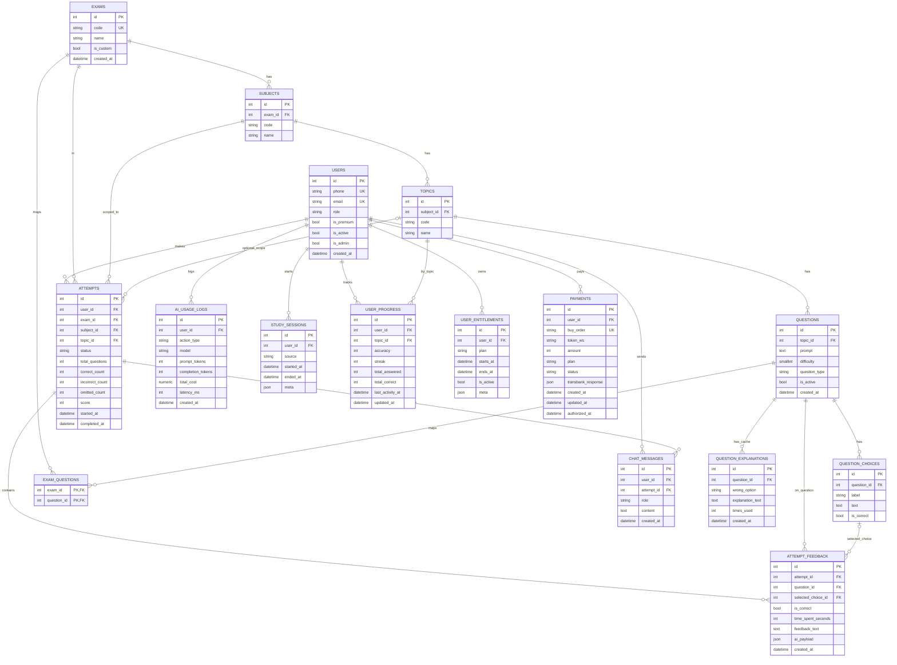

# Diagrama de Base de Datos - TutorPAES

## Estado del documento
- Tipo: documento operativo de arquitectura de datos.
- Estado: vigente.
- Última actualización: 2026-03-14.

## Objetivo
Proveer un diagrama ER (Entidad-Relación) único y compartible del esquema principal de base de datos de TutorPAES.

## Alcance
- Esquema ORM definido en backend.
- Entidades de catálogo, usuarios, quiz, IA, sesiones y pagos.
- Relaciones principales y llaves foráneas.

## Contenido principal

## Criterios de validación
- El diagrama debe renderizar correctamente en GitHub y visores Mermaid.
- Las entidades y relaciones deben corresponder al esquema definido en backend.
- Debe existir una única fuente compartible para el ERD en la carpeta DOCS.

## Referencias relacionadas
- `tutorpaes/backend/app/db/models.py`
- `DOCS/ARQUITECTURA_Y_ROADMAP_PRODUCCION.md`
