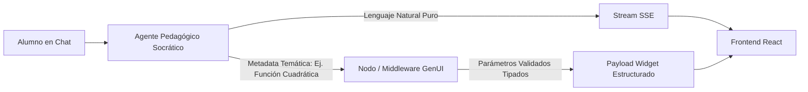

# AJUSTES ESTRATÉGICOS Y TÉCNICOS POST-ANÁLISIS CRÍTICO — TUTORPAES V3
> **Fecha:** 4 de Octubre de 2026  
> **Objetivo:** Documentar las correcciones a las críticas del panel técnico antes del piloto simultáneo de este sábado y la presentación ejecutiva.  
> **Estado:** Documentación de Arquitectura y Estrategia de Negocio  

---

## 1. Recalibración del Pitch y Narrativa de Negocio

### 1.1 El Problema (Síndrome de "Jerga de Backend")
En el guion de presentación actual (específicamente en torno al minuto 4), la ventaja competitiva ("unfair advantage") se defendía utilizando términos internos de ingeniería de software:
- *"Complejidad algorítmica $O(1)$ en base de datos relacional"*.
- *"Control de streaming e interrupción mediante AbortController"*.

**El riesgo:** Un jurado de negocios, directores de colegios o inversionistas EdTech no compran complejidades asintóticas; compran impacto en el alumno, viabilidad económica y retención escolar. Usar esta jerga equivale a venderle un automóvil a una familia destacando la aleación de titanio de los pistones en vez de la seguridad de sus hijos y el rendimiento por litro.

### 1.2 La Traducción a Métricas de Negocio (Unit Economics)

| Mensaje Técnico Original (Ingeniería) | Nueva Traducción Ejecutiva (Negocio & Pedagogía) | Impacto para el Cliente / Jurado |
| :--- | :--- | :--- |
| **"Estructura $O(1)$ en PostgreSQL"** | **"Costo Marginal a Fracciones de Centavo por Alumno"**: Nuestra arquitectura de datos ultraoptimizada permite a los colegios escalar tutoría personalizada 1:1 a un costo operativo prácticamente nulo. | Demuestra viabilidad económica y escalabilidad masiva sin inflar costos de infraestructura. |
| **"Control de streaming con AbortController"** | **"Tecnología de Fluidez Anti-Frustración"**: Algoritmo de corte y respuesta instantánea que evita pantallas congeladas, garantizando una interacción continua sin latencias que rompan la concentración de alumnos de 4° medio. | Demuestra empatía con el usuario joven y reducción directa de la tasa de abandono (*churn*). |
| **"Arquitectura multi-agente desacoplada"** | **"Co-Piloto Pedagógico Especializado"**: Múltiples inteligencias coordinadas donde un tutor enseña mientras otro audita el rigor curricular DEMRE en tiempo real. | Transmite seriedad institucional y alineamiento con la prueba oficial. |

---

## 2. Rediseño de Telemetría: Medir "Fricción Cognitiva", no solo tiempos de máquina

### 2.1 La Trampa del Tiempo de Resolución
Actualmente, la telemetría en PostgreSQL registra:
- Latencia de red / servidor.
- *Time to First Token* (TTFT).
- Tiempo total de resolución por ejercicio.
- Tasa binaria de acierto (Correcto / Incorrecto).

**El Peligro Metodológico:** Como TutorPAES implementa una **tutoría socrática anti-spoonfeeding** (no regalar la respuesta, sino guiar al alumno mediante preguntas reflexivas), el tiempo invertido por ejercicio **aumentará de forma natural**. Si un evaluador externo analiza los datos crudos, podría llegar a la conclusión errónea de que *"el alumno tardó 4 minutos con la IA versus 1 minuto con una pauta en papel, por lo tanto la IA es ineficiente"*.

### 2.2 Nuevas Métricas Cualitativas y Estructura en JSONB

Para demostrar empíricamente que un mayor tiempo es **esfuerzo cognitivo valioso** y no frustración, se incorporan los siguientes indicadores en el campo `metadata` / `attempt_telemetry`:

#### A. Ratio de Autonomía Post-Pistas (Hint-to-Success Ratio)
$$\text{Índice de Mitigación} = \frac{\text{Ejercicios Resueltos Autónomamente tras Pistas Socráticas}}{\text{Total de Pistas Solicitadas}}$$
- **Significado:** Si el estudiante se atasca, recibe una pista socrática de Tuto, y tras esa pista logra llegar a la respuesta correcta **sin pedir la solución final**, se demuestra empíricamente que la fricción fue superada gracias a la tutoría.

#### B. Detección Temprana de Frustración (Sentiment Triggers en `attempt_feedback`)
Un escáner léxico ultraligero que clasifica el texto del estudiante durante el chat interactivo:
- **Giro lingüístico de bloqueo:** Frases como *"no entiendo nada"*, *"paso"*, *"está muy difícil"*, *"me rindo"*.
- **Acción del sistema:** Etiqueta el evento en la telemetría como `high_friction_alert`, permitiendo que Tuto baje un nivel la dificultad de la pista antes de que ocurra el abandono de la sesión.

#### C. Esquema de Telemetría Propuesto (PostgreSQL JSONB)
```json
{
  "session_id": "sess_89412",
  "question_id": "m1_alg_cuadraticas_04",
  "resolution_seconds": 215,
  "cognitive_telemetry": {
    "socratic_turns_count": 3,
    "hints_requested": 1,
    "solution_spoonfed": false,
    "friction_overcome": true,
    "sentiment_flags": ["initial_doubt", "post_hint_breakthrough"],
    "abandonment_prevented": true
  },
  "technical_telemetry": {
    "ttft_ms": 480,
    "total_tokens": 320
  }
}
```

---

## 3. Resiliencia de GenUI: Desacoplar Widgets Visuales del Prompt del LLM

### 3.1 El Fallo Detectado en la Arquitectura Actual
En el Sprint 1, para mostrar componentes interactivos (como gráficos de parábolas o diagramas de geometría), se le instruyó al `system_prompt` del LLM principal generar cadenas de texto rígidas, por ejemplo:
```text
[widget:parabola a=1 b=-2 c=-3]
```

**Por qué es un riesgo crítico:**
1. Los Modelos de Lenguaje son **probabilísticos, no deterministas**. Un simple error tipográfico (una coma por un espacio, un paréntesis no cerrado o un escape inválido) hace que el parser de React en el frontend falle silenciosamente o lance una excepción.
2. Al transmitirse vía **Server-Sent Events (SSE)** en streaming carácter a carácter, un fallo tipográfico interrumpe el flujo del stream en vivo, congelando la interfaz del estudiante en pleno ejercicio.

### 3.2 Solución Arquitectónica: Inyección Determinista



1. **Aislamiento del Agente Pedagógico:** El LLM socrático se enfoca 100% en la pedagogía en lenguaje natural, sin la carga cognitiva ni el riesgo de formatear sintaxis de código de frontend.
2. **Middleware / Agente de Presentación Visual en Backend:**
   - La pregunta ya posee metadatos pedagógicos en base de datos (`materia: "m1"`, `eje: "algebra"`, `widget_type: "parabola_interactive"`).
   - El backend inyecta el widget de forma **programática y determinista** en el canal de eventos, con tipos estrictos (TypeScript / Pydantic).
   - El frontend recibe un bloque JSON garantizado, eliminando alucinaciones sintácticas y asegurando que la UI jamás colapse en producción.

---

## 4. Checklist de Preparación para el Piloto del Sábado

- [x] **Identidad Visual y Documento para Stitch:** `DESIGN.md` creado con paleta luminosa y especificación de Tuto.
- [x] **Conexión MCP Stitch:** Servidor MCP configurado y autenticado con la API Key proporcionada.
- [ ] **Ajuste del Script de Presentación:** Reemplazar el minuto 4 con la narrativa de costo marginal y tecnología anti-frustración.
- [ ] **Migración de Telemetría:** Añadir las columnas / campos JSONB de `hints_requested` y `friction_overcome` en la tabla de intentos.
- [ ] **Validación GenUI:** Asegurar que los widgets matemáticos se sirvan desde la metadata del ejercicio y no dependan de la sintaxis libre del LLM.
