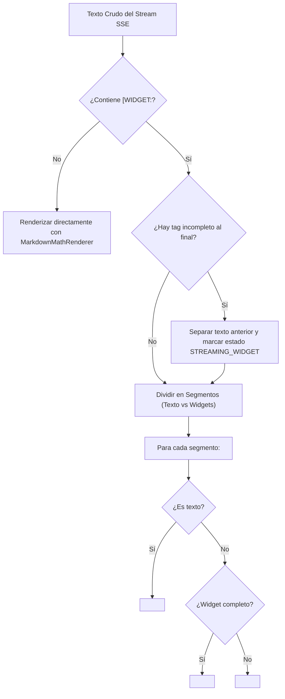

# Especificación de Arquitectura — Generative UI (GenUI) para Tutor Socrático

**Fecha:** 28 de Septiembre de 2026  
**Autor:** Agente 1 (Orquestador `agy`)  
**Audiencia:** Agente 2 (Backend `agy2`), Agente 3 (Frontend `claude`), Equipo de Desarrollo Tutor PAES  
**Estado:** Aprobado para Implementación

---

## 1. Visión y Principio Rector

El Tutor Socrático de Tutor PAES no debe limitarse a texto plano o fórmulas frías en KaTeX. Para conceptos matemáticos espaciales o abstractos de la PAES M1 (geometría, funciones cuadráticas, inecuaciones, fracciones), el estudiante necesita **andamiaje visual dinámico**.

### 🚫 Qué NO haremos:
- **No ejecutaremos código generado en tiempo de ejecución por la IA (no `eval`, no sandboxing de JS arbitrario):** Esto acarrearía vulnerabilidades de seguridad (XSS), latencias inaceptables y fallas impredecibles de compilación.

### ✅ Qué SÍ haremos (Patrón GenUI Declarativo):
- El backend/LLM actuará como un **invocador de componentes declarativos (Simulated Tool Calling)** emitiendo etiquetas semánticas estructuradas en el flujo SSE.
- El frontend (Next.js 16 / React 19) actuará como un **intérprete reactivo de alta velocidad**: interceptará las etiquetas antes del renderizado de Markdown/KaTeX y montará componentes React Client precompilados y estilizados con los tokens semánticos de Tailwind CSS.

---

## 2. Contrato de la Etiqueta (Gramática de Marcadores)

### Formato Canónico:
```text
[WIDGET:NOMBRE_WIDGET|param1=valor1&param2=valor2]
```

### Alternativa Soportada (JSON):
```text
[WIDGET:NOMBRE_WIDGET|{"param1": valor1, "param2": valor2}]
```

### Reglas de Emisión para el LLM:
1. La etiqueta debe emitirse preferentemente en una **línea independiente**, rodeada de saltos de línea `\n\n`.
2. **Cero colisión con LaTeX:** Las fórmulas en bloque usan `$$...$$` o `\[...\]`. La etiqueta de widget comienza explícitamente con `[WIDGET:` (sin contrabarra), lo que garantiza distinción 100% libre de ambigüedades.
3. El LLM nunca debe incluir código JSX ni HTML dentro de la etiqueta. Solo el nombre del widget y sus argumentos clave-valor.

---

## 3. Catálogo Inicial de Widgets para PAES M1

| Nombre del Widget | Propósito Pedagógico PAES | Parámetros Aceptados | Ejemplo de Invocación |
| :--- | :--- | :--- | :--- |
| **`PARABOLA`** | Visualización interactiva de funciones cuadráticas $f(x) = ax^2 + bx + c$, concavidad, vértice y raíces. | `a` (float), `b` (float), `c` (float), `show_vertex` (bool), `show_roots` (bool), `title` (string) | `[WIDGET:PARABOLA\|a=1&b=-4&c=3&show_vertex=true]` |
| **`NUMBER_LINE`** | Recta numérica para inecuaciones, intervalos reales, valor absoluto y distancias. | `min` (int), `max` (int), `interval` (string, ej: `[-2, 5)`), `points` (comma-separated, ej: `0, 3`), `title` (string) | `[WIDGET:NUMBER_LINE\|min=-5&max=5&interval=[-2,4)&points=0]` |
| **`RIGHT_TRIANGLE`** | Triángulo rectángulo para Teorema de Pitágoras y razones trigonométricas. | `a` (float/string), `b` (float/string), `c` (float/string), `highlight` (`a` \| `b` \| `c` \| `angle`), `show_formula` (bool) | `[WIDGET:RIGHT_TRIANGLE\|a=3&b=4&c=5&highlight=c]` |
| **`FRACTION_BAR`** | Representación gráfica de fracciones (suma, equivalencia y proporciones). | `num` (int), `den` (int), `color` (string, opcional) | `[WIDGET:FRACTION_BAR\|num=3&den=4]` |

---

## 4. Estrategia de Frontend (Instrucciones para Agente 3 — `claude`)

### 4.1. El Desafío del Streaming y la Prevención de Flicker
Durante el streaming SSE de Groq, los tokens llegan progresivamente:
`[` ➔ `WIDGET` ➔ `:PAR` ➔ `ABOLA` ➔ `|a=1` ➔ `&b=` ➔ `-4]`

Si se intenta renderizar de forma ingenua antes de recibir el cierre `]`:
1. Aparecería texto basura crudo en pantalla (`[WIDGET:PAR...`).
2. `rehype-katex` podría fallar si interpreta caracteres internos como fórmulas.

### 4.2. Algoritmo de Parseo e Intercepción (Regex + Lexer)

El frontend mantendrá `content` como string en el estado del hook (`useAiTutor` y `useAiExplanation`) para no romper la compatibilidad con el almacenamiento en base de datos ni con los tests unitarios.

La intercepción se ejecuta en la capa de renderizado mediante un componente wrapper: `<GenUIMessageRenderer content={message.content} />`.

#### Patrones Regex Clave:
1. **Etiqueta Completa:**
   ```typescript
   const WIDGET_COMPLETE_REGEX = /\[WIDGET:([A-Za-z0-9_-]+)\|([^\]]*)\]/g;
   ```
2. **Etiqueta Incompleta (Buffer de Streaming al final del texto):**
   ```typescript
   const WIDGET_STREAMING_REGEX = /\[WIDGET:([A-Za-z0-9_-]*)(?:\|([^\]]*))?$/;
   ```

#### Flujo del Lexer de Segmentos:


### 4.3. Parser de Argumentos Resiliente:
```typescript
export function parseWidgetArgs(rawArgs: string): Record<string, any> {
  const trimmed = rawArgs.trim();
  if (!trimmed) return {};

  // 1. Soporte JSON
  if (trimmed.startsWith('{') && trimmed.endsWith('}')) {
    try {
      return JSON.parse(trimmed);
    } catch {
      // fallback a query params
    }
  }

  // 2. Soporte Query-Params (a=1&b=2 o a=1;b=2)
  const normalized = trimmed.replace(/;/g, '&');
  const params = new URLSearchParams(normalized);
  const result: Record<string, any> = {};

  params.forEach((value, key) => {
    const valTrim = value.trim();
    if (valTrim === 'true') result[key] = true;
    else if (valTrim === 'false') result[key] = false;
    else if (!isNaN(Number(valTrim)) && valTrim !== '') result[key] = Number(valTrim);
    else result[key] = valTrim;
  });

  return result;
}
```

### 4.4. Regla Estricta para Síntesis de Voz (TTS / `useVoice`)
En `AiTutorChat.tsx`, la llamada `speak(m.content)` debe limpiar las etiquetas antes de sintetizar voz:
```typescript
const cleanTextForSpeech = (rawContent: string): string => {
  return rawContent
    .replace(/\[WIDGET:[^\]]*\]/g, '') // Elimina widgets completos
    .replace(/\[WIDGET:[^\]]*$/g, '')  // Elimina widgets en stream
    .trim();
};
```
Esto evita que la voz sintetizada pronuncie absurdos como *"corchete widget dos puntos parábola"*.

---

## 5. Estrategia de Backend (Instrucciones para Agente 2 — `agy2`)

### 5.1. Adaptación del System Prompt Pedagógico
En `tutorpaes/backend/app/services/chatbot_service.py`, inyectar la siguiente sección en `SYSTEM_PROMPT_PEDAGOGICAL`:

```text
═══ HERRAMIENTAS VISUALES INTERACTIVAS (GENERATIVE UI) ═══
Tienes acceso a componentes visuales interactivos en la pantalla del estudiante. Puedes invocarlos cuando una explicación geométrica, algebraica o visual facilite el entendimiento.

REGLAS DE EMISIÓN:
1. Emite la etiqueta en su propia línea separada por saltos de línea.
2. Formato estricto: [WIDGET:NOMBRE|param1=valor1&param2=valor2]
3. NUNCA uses un widget para dar la respuesta final en bandeja. Úsalo como andamiaje exploratorio (método socrático).

CATÁLOGO AUTORIZADO:
- [WIDGET:PARABOLA|a=NUM&b=NUM&c=NUM&show_vertex=BOOL]
  Para funciones cuadráticas. Permite al alumno ver la concavidad, vértice y cortes con ejes.
- [WIDGET:NUMBER_LINE|min=NUM&max=NUM&interval=STRING&points=LISTA]
  Para inecuaciones, intervalos reales y valor absoluto (ej: [WIDGET:NUMBER_LINE|min=-5&max=5&interval=[-2,3)&points=0]).
- [WIDGET:RIGHT_TRIANGLE|a=NUM&b=NUM&c=NUM&highlight=LADO]
  Para Teorema de Pitágoras y razones trigonométricas (highlight puede ser 'a', 'b', 'c' o 'angle').
- [WIDGET:FRACTION_BAR|num=NUM&den=NUM]
  Para representar gráficamente proporciones y fracciones.

EJEMPLO DE USO SOCRÁTICO:
"Fíjate en cómo se comporta esta función cuadrática cuando cambiamos el signo del término $a$:

[WIDGET:PARABOLA|a=-1&b=2&c=3&show_vertex=true]

¿Hacia dónde se abren los brazos de la curva? ¿Qué relación tiene eso con el signo negativo de $x^2$?"
```

---

## 6. Plan de Ejecución Inmediata por Agente

### Tareas Agente 3 (`claude` — Worktree `.worktrees/sprint-frontend`):
1. **Crear `src/features/ai/widgets/`:**
   - `ParabolaWidget.tsx` (SVG reactivo y responsive con ejes cartesianos y vértice estilizado con Tailwind).
   - `NumberLineWidget.tsx` (SVG de recta numérica con intervalos abiertos/cerrados).
   - `RightTriangleWidget.tsx` (SVG con catetos e hipotenusa resaltados).
   - `FractionBarWidget.tsx` (Barras visuales de fracciones).
   - `WidgetRegistry.tsx` (Mapa de widgets dinámicos).
2. **Crear `GenUIMessageRenderer.tsx`:**
   - Implementar el lexer de streaming y montar el esqueleto de carga cuando el tag está incompleto.
3. **Reemplazar `MarkdownMathRenderer` en `AiTutorChat.tsx` y `AiExplanation.tsx`** por `<GenUIMessageRenderer />`.
4. **Sanitizar `useVoice`** con `cleanTextForSpeech`.
5. **Verificar tests:** Asegurar que `npm test` pase al 100% (34+ tests).

### Tareas Agente 2 (`agy2` — Worktree `.worktrees/sprint-backend`):
1. **Actualizar `SYSTEM_PROMPT_PEDAGOGICAL`** en `tutorpaes/backend/app/services/chatbot_service.py`.
2. **Agregar tests unitarios** en `tutorpaes/backend/tests/test_chatbot_service.py` que verifiquen que las respuestas con tags `[WIDGET:...]` se transmiten limpiamente en el stream SSE sin errores de codificación.
3. **Verificar tests:** Asegurar que `pytest tests` mantenga los 97 tests en verde.
