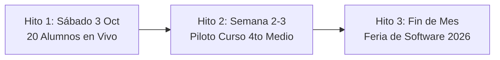

# 01 — Visión del Producto y Objetivos Estratégicos

**Proyecto:** Tutor PAES V3  
**Fecha:** 28 de Septiembre de 2026  
**Audiencia:** Agentes de desarrollo (`agy`, `agy2 / gemini2`, `claude`, `opencode`) y equipo docente.  

---

## 1. Problema Central

En Chile, la **Prueba de Acceso a la Educación Superior (PAES)** determina en gran medida las oportunidades de desarrollo universitario de cientos de miles de jóvenes. Sin embargo, existe una brecha estructural profunda:

1. **Inequidad de Acceso a Preparación de Calidad:** Los preuniversitarios tradicionales de alto rendimiento tienen costos elevados e inalcanzables para la mayoría de las familias de colegios municipales y subvencionados.
2. **Métodos Pasivos y Masivos:** Los preuniversitarios convencionales entregan clases expositivas masivas y pautas de respuestas frías (PDFs con letras `A`, `B`, `C`), donde el estudiante que no entiende se queda atrás sin retroalimentación inmediata.
3. **Falta de Acompañamiento Socrático en Tiempo Real:** Cuando un alumno se equivoca a las 11 de la noche haciendo un ensayo en su casa, no tiene a quién preguntarle. Termina frustrado o memorizando respuestas sin comprender el razonamiento subyacente.

### Qué buscamos resolver y demostrar con este proyecto:
Demostrar que una plataforma digital impulsada por **Inteligencia Artificial Socrática y Adaptativa** puede ofrecer una tutoría personalizada 24/7, que no entrega la respuesta en bandeja, sino que acompaña al estudiante paso a paso mediante pistas guiadas, razonamiento matemático estructurado (KaTeX) y comprensión lectora profunda, democratizando el entrenamiento de alto nivel para la PAES.

---

## 2. Alcance del Sistema (Límites del Proyecto)

Para garantizar un desarrollo ágil y sin dispersión de cara a los ensayos reales y la Feria de Software, los límites están estrictamente trazados:

### ✅ Lo que el sistema HACE (In-Scope):
* **Motor de Ensayos y Quizzes Focalizados:** Rendición de pruebas oficiales cronometradas y micro-quizzes por habilidad y eje temático (Matemática M1/M2, Competencia Lectora, Ciencias, Historia).
* **Tutor Pedagógico Socrático (SSE Streaming):**
  * Modo Pista (`/hint`): Ofrece un primer andamiaje conceptual sin develar la opción correcta.
  * Modo Explicación Paso a Paso (`/explain`): Desglosa la resolución de forma analítica cuando el alumno ya falló o concluyó el intento.
  * Chat Interactivo con Memoria de Intento: Diálogo en vivo con el tutor sobre la pregunta activa.
* **Renderizado Matemático KaTeX de Alta Fidelidad:** Soporte nativo para fracciones, potencias, raíces, geometría y expresiones algebraicas en enunciados y respuestas.
* **Dashboard del Estudiante:** Métricas de rendimiento, historial de intentos, puntaje estimado y gráficos de debilidades por eje temático DEMRE.
* **Módulo Institucional / Docente (`TeacherDashboardView`):**
  * Creación y gestión de cursos colegiales (ej. 4to Medio).
  * Monitoreo en tiempo real del progreso y las materias más descendidas de los estudiantes del curso.
* **Seguridad y Resiliencia:** Autenticación JWT en cookies httpOnly, roles (alumno, profesor, admin), Circuit Breaker y fallback dinámico entre proveedores LLM (OpenAI ➔ Groq ➔ Cerebras).

### ❌ Lo que el sistema NO HACE (Out-of-Scope para este ciclo):
* **No es una red social estudiantil:** No hay mensajería entre alumnos, muros ni foros de discusión.
* **No reemplaza la plataforma oficial del DEMRE:** Los puntajes entregados son estimaciones pedagógicas estandarizadas basadas en las tablas de conversión vigentes.
* **No procesa pagos con datos bancarios propios:** La facturación delega el 100% de la transacción en el SDK oficial de Transbank Webpay Plus.
* **No genera preguntas alucinadas sin validación:** El motor se alimenta de un banco curado y verificado; la IA actúa como tutor explicativo sobre ejercicios formalmente calibrados.

---

## 3. Hitos de Éxito Inmediatos y Medibles

Para salir de cualquier estancamiento y validar el avance con evidencia dura, se establecen tres compuertas de éxito cronológicas:

### 🎯 Hito 1: Prueba de Fuego del Sábado (En 5 días — 3 de Octubre)
* **Objetivo:** 20 alumnos reales rindiendo un ensayo diagnóstico completo simultáneamente desde sus casas o dispositivos vía URL pública.
* **Resultados medibles requeridos:**
  * 0 caídas del servidor (0 errores 500 en backend y frontend).
  * Banco blindado con al menos 30 preguntas de Matemática M1 y 30 de Lectora sin errores tipográficos ni fórmulas truncadas.
  * Latencia de streaming del Tutor IA inferior a 1.5 segundos para el primer token.
  * 100% de los intentos registrados y calificados en la base de datos con visualización correcta de resultados.

### 🏫 Hito 2: Piloto en Aula con Curso de 4to Medio (Profesor: Hermano de Gabriel)
* **Objetivo:** Implementación del flujo B2B/Colegio en un curso real de 4to medio.
* **Resultados medibles requeridos:**
  * Profesor asigna ensayos específicos al curso desde el panel docente.
  * Los alumnos completan los ejercicios y el profesor visualiza en su dashboard la radiografía de debilidades grupales (ej: "70% del curso falló en Función Cuadrática").
  * Feedback cualitativo de usabilidad por parte del profesor y alumnos.

### 🏆 Hito 3: Puesta en Escena en la Feria de Software (Fines de Octubre)
* **Objetivo:** Demostración pública de alto impacto ante jurados académicos e inversionistas.
* **Resultados medibles requeridos:**
  * Pitch de 3 minutos ejecutado en vivo con el "Golden Path" (interacción instantánea con el Tutor IA en streaming frente al jurado).
  * Código QR público en el stand para que los visitantes prueben en sus teléfonos.
  * Instancia local de respaldo con `scripts/dev-up.sh` lista en caso de saturación del Wi-Fi del evento.
