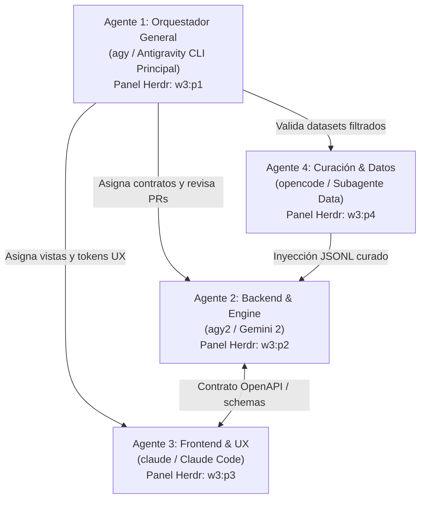
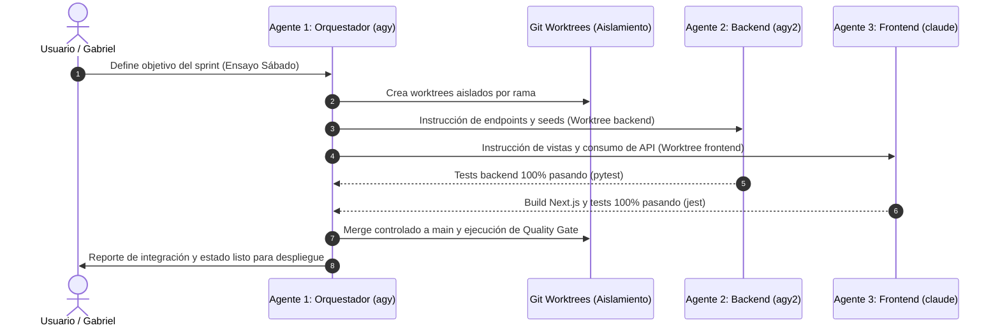

# 02 — Arquitectura Multi-Agente y Estrategia de Concurrencia

**Proyecto:** Tutor PAES V3  
**Fecha:** 28 de Septiembre de 2026  
**Entorno de Ejecución:** Herdr Terminal Workspace (`w3` - Tutor PAES)  

---

## 1. Definición de Agentes y Roles

El desarrollo acelerado del proyecto se distribuye entre **cuatro agentes especializados**, cada uno con un contexto de ejecución, límites de responsabilidad y herramientas bien definidas para evitar sobreescrituras y alucinaciones cruzadas.

### 🧠 Agente 1: Orquestador y Arquitecto del Sistema (`agy` / Antigravity CLI Principal)
* **Panel Herdr:** `w3:p1` (Cuenta principal, `HOME=/home/gabriel`)
* **Responsabilidades:**
  * Supervisión global de la arquitectura y gobernanza de Git.
  * Creación y gestión de Git Worktrees para aislar las ramas de cada agente.
  * Ejecución de compuertas de calidad (Quality Gates): revisión de suites de tests integrales (`pytest` y `jest`).
  * Despliegue en la nube (Vercel, Railway/Render) y pruebas de integración end-to-end.
* **Herramientas Clave:** `codebase-memory-mcp` (Knowledge Graph), `run_command`, `view_file`, `replace_file_content`, scripts de gestión.
* **Prompt Base Directivo:**
  > *"Actúas como Tech Lead y Arquitecto de Software de Tutor PAES. Tu misión es mantener la estabilidad del sistema, coordinar a los agentes especialistas mediante contratos de interfaz claros, asegurar que ningún commit rompa los 97 tests de backend o 34 de frontend, y liderar el despliegue hacia la prueba de 20 alumnos y la Feria de Software."*

---

### ⚡ Agente 2: Backend & Engine Developer (`agy2` / Gemini 2)
* **Panel Herdr:** `w3:p2` (Cuenta 2, `HOME=/home/gabriel/.agy-profiles/cuenta2`)
* **Responsabilidades:**
  * Lógica de negocio en FastAPI (`tutorpaes/backend/app/`).
  * Modelos de datos SQLAlchemy 2.0 y migraciones Alembic.
  * Resiliencia del Tutor IA: Circuit Breakers, timeouts y reintentos en `llm_provider_service.py`.
  * Optimización de concurrencia: Pooling de base de datos (`pool_size: 20`, `max_overflow: 30`) para garantizar 0 cuellos de botella con 20 alumnos simultáneos.
  * Endpoints de salud (`/health`), métricas Prometheus (`/metrics`) y scripts de seed (`seed_paes_data.py`, `seed_user.py`).
* **Herramientas Clave:** Python virtualenv (`.venv/bin/pytest`), Alembic, psycopg, Uvicorn.
* **Prompt Base Directivo:**
  > *"Eres el Ingeniero de Backend y Base de Datos de Tutor PAES. Trabajas exclusivamente bajo tutorpaes/backend/. Tus estándares son: sintaxis moderna SQLAlchemy 2.0 (select/scalar), tipado estricto con Pydantic v2, manejo seguro de errores con códigos HTTP semánticos y tests automatizados para cada nuevo endpoint. Tu meta inmediata es garantizar que la API responda con 0 errores y latencia mínima bajo concurrencia de 20 alumnos."*

---

### 🎨 Agente 3: Frontend & UX Specialist (`claude` / Claude Code)
* **Panel Herdr:** `w3:p3` (Claude Code)
* **Responsabilidades:**
  * Desarrollo de interfaz en Next.js 16 (App Router) y React 19 (`tutorpaes/frontend/`).
  * Renderizado impecable de preguntas, alternativas y fórmulas KaTeX (`rehype-katex`, `remark-math`).
  * Consumo de eventos en streaming SSE (`/api/ai/explain`, `/api/ai/hint`) y chat socrático con el Tutor IA (`AiTutorChat`).
  * Experiencia móvil/desktop y accesibilidad (WCAG 2.1 AA) en el Quiz y en los Dashboards de Estudiante y Profesor (`TeacherDashboardView`).
* **Herramientas Clave:** Node.js 20+, npm, Next.js Turbopack (`next build`), Jest + React Testing Library.
* **Prompt Base Directivo:**
  > *"Eres el Especialista de Frontend y Experiencia de Usuario de Tutor PAES. Trabajas exclusivamente en tutorpaes/frontend/. Tus principios son: cero pantallas congeladas, feedback visual inmediato, diseño oscuro consistente con tokens Tailwind semánticos (rgb con soporte de opacidad), renderizado perfecto de matemáticas con KaTeX y manejo robusto de desconexiones en streaming SSE."*

---

### 📊 Agente 4: Curación y Datos (`opencode` / Subagente Data)
* **Panel Herdr:** `w3:p4` o terminal dedicado
* **Responsabilidades:**
  * Procesamiento y filtrado algorítmico del dataset de 508 preguntas desde `salida_lista_hoy/`.
  * Detección y descarte de ruido OCR (fragmentos rotos como `= 2 2`, textos incompletos, alternativas duplicadas).
  * Validación de que cada pregunta de Matemática M1 y Lenguaje cuente con enunciado íntegro, alternativas claras y explicación pedagógica lista para la base de datos.
* **Herramientas Clave:** Python scripts de inspección JSONL, validadores estructurales de datos.

---

## 2. Flujo de Interacción y Comunicación entre Agentes

Para evitar interferencias en una sesión de alta velocidad, los agentes operan bajo un **modelo jerárquico-colaborativo desacoplado**:

### Reglas de Aislamiento y Memoria Compartida:
1. **Aislamiento por Git Worktrees:**  
   Cada agente trabaja en una copia de trabajo aislada en `.worktrees/`:
   * `backend` en `.worktrees/sprint-backend`
   * `frontend` en `.worktrees/sprint-frontend`  
   *Esto elimina conflictos de merge en caliente y bloqueos de dependencias (`node_modules`, `.venv`).*
2. **Contrato de API como Única Frontera:**  
   El backend y el frontend se comunican mediante especificaciones OpenAPI bien definidas. Si el backend cambia un endpoint, primero actualiza el esquema Pydantic y el tipo TypeScript correspondiente.
3. **Bóveda de Obsidian Exclusiva:**  
   Toda nota documental, decisión arquitectónica o bitácora de investigación se escribe exclusivamente en:  
   `/home/gabriel/Memoria semantica/TutorPAES/`  
   *(Queda estrictamente prohibido tocar o cruzar notas con `/home/gabriel/AGENTES/Panaderia-Inteligente`).*

---

## 3. Patrones de Diseño de Software para Concurrencia y Resiliencia

Para asegurar que el sábado 20 estudiantes interactúen sin interrupciones, se implementan los siguientes patrones:

1. **Patrón BFF (Backend for Frontend):**  
   Next.js expone rutas proxy `/api/*` que manejan las cookies httpOnly con el token JWT. El navegador del estudiante jamás expone claves privadas ni llama directamente a la API interna, protegiendo contra ataques XSS/CSRF.
2. **Circuit Breaker y Cascada Multi-LLM (`CircuitBreaker`):**  
   Si 20 alumnos presionan "Pedir pista" al mismo tiempo y OpenAI satura su rate limit, el sistema conmuta automáticamente y sin error visible a **Groq (Llama 3.3)** o **Cerebras (Llama 3.1 70B)**, reintentando con backoff exponencial antes de lanzar un fallo.
3. **Pre-Ping Connection Pool:**  
   SQLAlchemy mantiene un pool de 20 conexiones base + 30 de desborde (`pool_size=20`, `max_overflow=30`) con `pool_pre_ping=True`, evitando conexiones TCP muertas o caídas de base de datos durante el ensayo de 20 alumnos.
4. **Acumulación de Buffer SSE:**  
   En el frontend, el hook de streaming (`use-ai-tutor.ts` y `use-ai-explanation.ts`) utiliza buffers acumuladores para que el texto de la IA aparezca fluido y suave en pantalla, incluso si la red del alumno experimenta jitter o saltos de paquetes.
