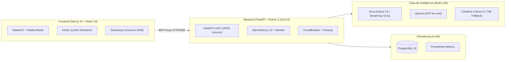

# 03 — Stack Tecnológico y Entorno de Ejecución

**Proyecto:** Tutor PAES V3  
**Fecha:** 28 de Septiembre de 2026  
**Auditoría de Entorno:** Ubuntu Linux (x86_64)  

---

## 1. Frameworks, Bibliotecas y Modelos

El stack de TutorPAES está diseñado combinando **velocidad de desarrollo, robustez estricta de tipos y latencia ultra-baja** para la experiencia del estudiante.



### A. Capa de Backend (FastAPI Core)
* **Framework Web:** `FastAPI` (v0.115+) sobre servidor ASGI `uvicorn`.
* **Validación de Datos:** `pydantic` (v2.x) con modelos fuertemente tipados para request/response.
* **ORM & Acceso a Datos:** `SQLAlchemy` (v2.0+) con sintaxis moderna `select()`, `db.scalar()` y soporte de pool transaccional.
* **Control de Esquema y Migraciones:** `Alembic` (con versionamiento estricto en `migrations/versions/`).
* **Seguridad y Criptografía:** `passlib[bcrypt]` (`bcrypt==4.0.1` para compatibilidad) y `python-jose` para tokens JWT.
* **Control de Tráfico y Resiliencia:** `slowapi` (Rate Limiting basado en IP/usuario) y `tenacity` (reintentos exponenciales).
* **Observabilidad y Métricas:** `prometheus-client` exponiendo endpoint oficial en `/metrics` integrado con middleware de latencia y conteo de llamadas LLM.

### B. Capa de Modelos de Lenguaje (Multi-LLM)
* **Proveedor Primario para Feria/Streaming:** **Groq Cloud** (`llama-3.3-70b-versatile` / `mixtral-8x7b-32768`).  
  * *Razón:* Time-to-First-Token (TTFT) inferior a 0.4 segundos, ideal para streaming en vivo frente a alumnos y jurados.
* **Proveedor de Alta Complejidad:** **OpenAI** (`gpt-4o-mini`).  
  * *Razón:* Excelente comprensión pedagógica para razonamiento largo y análisis de textos complejos de Lenguaje.
* **Proveedor de Respaldo de Ultra-Velocidad:** **Cerebras Cloud SDK** (`llama-3.1-70b`).
* **Gestor de Claves:** `KeyManager` ([`tutorpaes/backend/app/core/key_management.py`](file:///home/gabriel/Escritorio/Proyectos2026/Tutor-PaesV3/tutorpaes/backend/app/core/key_management.py)) con soporte para rotación programada y períodos de gracia.

### C. Capa de Frontend (Next.js Application)
* **Framework:** `Next.js` 16.2.4 utilizando **App Router** y compilador **Turbopack**.
* **Librería de UI:** `React` 19.2.4 con TypeScript 5.
* **Motor de Estilos:** `Tailwind CSS` 3.4.1 con canales RGB semánticos y modificadores de opacidad dinámicos (`bg-brand-primary/10`, `border-surface-container/60`).
* **Renderizado Matemático:** `katex`, `rehype-katex` y `remark-math` con hojas de estilo oficiales para expresiones DEMRE.
* **Gestión de Estado de Servidor:** `@tanstack/react-query` para caché, invalidación y revalidación de datos del quiz.
* **Iconografía:** `lucide-react`.

---

## 2. Entorno de Ejecución e Infraestructura

### Entornos Locales y de Desarrollo
* **Python Virtualenv Canónico:**  
  Ubicado en la raíz del proyecto: [`/home/gabriel/Escritorio/Proyectos2026/Tutor-PaesV3/.venv`](file:///home/gabriel/Escritorio/Proyectos2026/Tutor-PaesV3/.venv) (Python 3.14 con 97/97 tests pasando).
* **Base de Datos Relacional Local:**  
  PostgreSQL 16 corriendo en contenedor Docker oficial vía [`tutorpaes/backend/docker-compose.yml`](file:///home/gabriel/Escritorio/Proyectos2026/Tutor-PaesV3/tutorpaes/backend/docker-compose.yml) (puerto host `5432`).
* **Conexión de Base de Datos:**  
  Driver `postgresql+psycopg://` (psycopg v3 nativo sin compiladores externos).
* **Gestión de Sesiones Concurrentes:**  
  Herdr Terminal Workspace (`w3` - Tutor PAES) coordinando paneles tmux/wezterm con detección automática de estado.

### Arquitectura de Despliegue en la Nube (Piloto Sábado & Feria)
* **Frontend:** Alojado en **Vercel** conectado a la rama `main` de GitHub.
* **Backend API:** Contenedor Docker en **Railway** o **Render** con Uvicorn multi-worker.
* **Base de Datos Producción:** PostgreSQL administrado (Railway / Supabase / Neon) con conexión SSL forzada y pool transaccional.

---

## 3. Estructura Canónica del Repositorio

El proyecto mantiene una estructura modular limpia y saneada:

```text
/home/gabriel/Escritorio/Proyectos2026/Tutor-PaesV3/
├── README.md                      # Runbook principal del proyecto
├── CLAUDE.md                      # Convenciones, reglas y límites de agentes
├── .venv/                         # Entorno virtual de Python con todas las deps
├── scripts/                       # Utilidades de automatización
│   ├── dev-up.sh                  # Orquestador local (Docker DB + Backend + Frontend)
│   ├── dev-down.sh                # Detención limpia de servicios
│   ├── db-backup.sh / db-restore  # Procedimientos de respaldo PostgreSQL
│   └── auto_update_docs.py        # Generador dinámico de métricas de tests y estado
├── docs/                          # Documentación técnica canónica
│   ├── NAVIGATION.md              # Índice maestro de documentación
│   ├── architecture/              # Diagramas ER, arquitectura y costos
│   ├── security/                  # Políticas de API keys y bases de seguridad
│   ├── operations/                # Guías de despliegue y runbooks operativos
│   ├── status/                    # Reportes de estado y auditorías Git
│   └── contexto_agentes/          # Radiografía integral para trabajo multi-agente
└── tutorpaes/
    ├── backend/                   # API FastAPI
    │   ├── Dockerfile
    │   ├── alembic.ini
    │   ├── requirements.txt
    │   ├── pytest.ini
    │   ├── app/
    │   │   ├── main.py            # Entrypoint ASGI, middlewares, rutas y lifespan
    │   │   ├── core/              # Config, seguridad, logging, Prometheus, rate limit
    │   │   ├── db/                # Modelos SQLAlchemy 2.0 (models.py) y sesión
    │   │   ├── schemas/           # Pydantic v2 schemas para API
    │   │   └── services/          # LLM Provider, OpenAI, Groq, Cerebras, Voice
    │   ├── migrations/            # Historial de versiones Alembic
    │   ├── scripts/               # Seeds de BD (seed_paes, seed_questions, seed_user)
    │   └── tests/                 # Suite de 97 tests unitarios y de integración
    └── frontend/                  # Aplicación Next.js 16 (App Router)
        ├── package.json
        ├── next.config.ts         # Configuración Turbopack y proxy
        ├── tailwind.config.ts     # Tokens semánticos RGB
        ├── jest.config.ts         # Suite de 34 tests unitarios de frontend
        ├── app/
        │   ├── layout.tsx         # Root layout con providers y KaTeX CSS
        │   ├── page.tsx           # Landing page
        │   ├── auth/              # Login, registro, recuperación de contraseña
        │   ├── api/               # BFF proxy layers (ai, auth, backend, payments)
        │   └── protected/         # Vistas autenticadas
        │       ├── page.tsx       # Dashboard estudiantil
        │       ├── quiz/          # Interfaz activa de resolución de preguntas
        │       ├── cursos/        # Vistas de cursos y panel de profesores
        │       ├── progreso/      # Analíticas de avance
        │       └── ranking/       # Tabla de posiciones
        └── src/
            ├── components/        # Componentes UI reutilizables
            ├── features/ai/       # Chatbot socrático y hooks de streaming SSE
            └── lib/               # Cliente API fetch, utilidades y helpers auth
```
