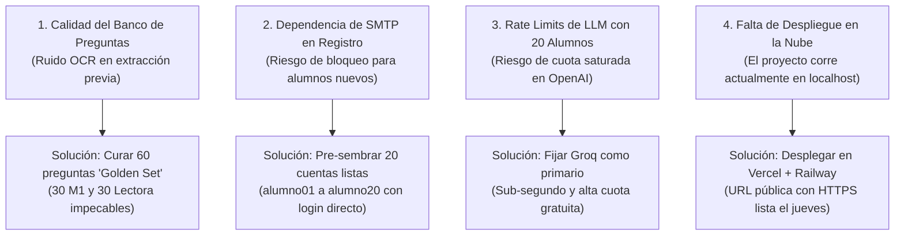

# 04 — Estado Actual, Puntos de Fricción y Backlog Inmediato

**Proyecto:** Tutor PAES V3  
**Fecha:** 28 de Septiembre de 2026  
**Auditoría de Calidad:** Verificada en vivo en el entorno de desarrollo  

---

## 1. Progreso Real y Componentes Sólidos (100% Operativos)

El proyecto cuenta con una base de código probada y estable en sus capas fundamentales:

| Componente | Estado Verificado | Evidencia Técnica |
| :--- | :---: | :--- |
| **Backend API (FastAPI)** | 🟢 **100% Operativo** | **97/97 tests pasando** en `.venv/bin/pytest`. Módulos de autenticación, catálogo, quizzes, pagos y resiliencia de IA verificados. |
| **Frontend Web (Next.js)** | 🟢 **100% Operativo** | **34/34 tests pasando** en `jest`. **Compilación exitosa en 5.8s** con Next.js 16.2.4 (Turbopack) para 28 rutas estáticas y dinámicas. |
| **Integridad del Repositorio** | 🟢 **100% Limpio** | Rama `main` sincronizada, 2.1 GB de worktrees muertos eliminados y gobernanza documental en `docs/`. |
| **Streaming SSE de IA** | 🟢 **Operativo** | Conexión fluida para pistas (`/hint`) y explicaciones (`/explain`) con buffer acumulador en el cliente para evitar saltos de texto. |
| **Renderizado Matemático** | 🟢 **Operativo** | KaTeX procesa expresiones algebraicas, potencias, fracciones y matrices en enunciados y alternativas. |
| **Observabilidad** | 🟢 **Operativo** | Endpoint `/metrics` expone métricas Prometheus de latencia, requests totales y fallos de proveedores LLM. |

---

## 2. Puntos de Fricción y Cuellos de Botella Detectados

Tras el análisis integral del código y los antecedentes de las iteraciones anteriores, se identifican **cuatro áreas críticas que requieren atención inmediata**:

### ⚠️ Fricción 1: Ruido en las Preguntas del Dataset Masivo
* **Causa Raíz:** El pipeline automático de extracción de PDFs (`salida_lista_hoy/`) extrajo 508 preguntas, pero muchas sufrieron deformación de fórmulas complejas por limitaciones del OCR (dejando textos como `= 2 2` o enunciados sin alternativas completas, como se reporta en `revision_manual_legible.txt`). Por esta razón el proyecto de datos quedó en standby.
* **Impacto en el Piloto:** Si un alumno recibe una pregunta deformada durante el ensayo del sábado, la prueba pierde seriedad inmediatamente.
* **Estrategia de Mitigación:** En lugar de intentar reparar las 508 preguntas de golpe, se debe filtrar y aislar un **"Golden Set" de 30 preguntas de Matemática M1 y 30 de Lenguaje** 100% verificadas, con enunciado completo, alternativas perfectas y explicación coherente.

### ⚠️ Fricción 2: Dependencia de Correo (SMTP) para Validación de Alumnos
* **Causa Raíz:** El flujo estándar de registro en producción suele enviar correos de activación. Si un alumno intenta registrarse el sábado y el servidor SMTP no está configurado o el correo cae en spam, el alumno queda fuera.
* **Estrategia de Mitigación:**  
  1. Proveer 20 cuentas pre-sembradas en la base de datos (`alumno01@tutorpaes.cl` a `alumno20@tutorpaes.cl`) con contraseña conocida (`paes2026`).  
  2. Ajustar el endpoint de registro para que active la cuenta inmediatamente durante la fase de pruebas piloto.

### ⚠️ Fricción 3: Concurrencia de LLM en Peticiones Simultáneas
* **Causa Raíz:** Si los 20 alumnos consultan al Tutor IA al mismo tiempo, las cuotas por minuto de OpenAI (Tier 1) pueden lanzar errores `429 Too Many Requests`.
* **Estrategia de Mitigación:** Activar **Groq Cloud** (`llama-3.3-70b`) como proveedor principal en el `.env` de producción. Groq ofrece generación ultra-rápida (>300 tokens/segundo) y cuotas generosas sin costo, manteniendo a OpenAI y Cerebras como respaldos automáticos en el Circuit Breaker.

### ⚠️ Fricción 4: Ausencia de URL Pública en Producción
* **Causa Raíz:** El stack funciona perfectamente en local (`scripts/dev-up.sh`), pero los 20 alumnos se conectarán desde sus casas o teléfonos móviles.
* **Estrategia de Mitigación:** Ejecutar el despliegue del frontend en **Vercel** y el backend con PostgreSQL en **Railway/Render** a más tardar el día jueves, permitiendo 24 horas completas de pruebas previas al sábado.

---

## 3. Backlog Inmediato (Sprint de 5 Días hacia el Sábado)

Este backlog define las tareas prioritarias a distribuir entre los agentes de desarrollo:

### 📅 Lunes y Martes (Días 1 y 2): Curación del Banco de Preguntas Dorado
- [ ] **Tarea 1.1 (Agente 4 / Data):** Ejecutar script de filtrado estricto sobre `salida_lista_hoy/` para extraer las mejores 30 preguntas de Matemática M1 y 30 de Competencia Lectora sin ruido ni fórmulas rotas.
- [ ] **Tarea 1.2 (Agente 2 / Backend):** Actualizar [`tutorpaes/backend/scripts/seed_paes_data.py`](file:///home/gabriel/Escritorio/Proyectos2026/Tutor-PaesV3/tutorpaes/backend/scripts/seed_paes_data.py) para inyectar este "Golden Set" y crear los dos ensayos oficiales: `Ensayo Diagnóstico Matemática M1` y `Ensayo Diagnóstico Lectora`.
- [ ] **Tarea 1.3 (Agente 3 / Frontend):** Validar visualmente en el Quiz que las 60 preguntas rendericen sus fórmulas KaTeX y párrafos de lectura sin desbordes de texto.

### 📅 Miércoles (Día 3): Cuentas de Acceso y Resiliencia Concurrente
- [ ] **Tarea 2.1 (Agente 2 / Backend):** Crear script [`scripts/seed_pilot_students.py`](file:///home/gabriel/Escritorio/Proyectos2026/Tutor-PaesV3/scripts/) para generar las 20 cuentas de alumnos (`alumno01` a `alumno20`) y 1 cuenta docente para el hermano de Gabriel (`profesor.hermano@tutorpaes.cl`).
- [ ] **Tarea 2.2 (Agente 2 / Backend):** Configurar y testear en el Circuit Breaker las credenciales de Groq Cloud para respuestas de streaming de <1 segundo.
- [ ] **Tarea 2.3 (Agente 3 / Frontend):** Verificar que el panel de profesor ([`TeacherDashboardView`](file:///home/gabriel/Escritorio/Proyectos2026/Tutor-PaesV3/tutorpaes/frontend/src/features/teacher/)) liste a los 20 alumnos y sus resultados una vez rendido el ensayo.

### 📅 Jueves (Día 4): Despliegue en la Nube
- [ ] **Tarea 3.1 (Agente 1 / Orquestador):** Desplegar backend y PostgreSQL en Railway/Render con variables de entorno de producción.
- [ ] **Tarea 3.2 (Agente 1 / Orquestador):** Desplegar frontend en Vercel con `NEXT_PUBLIC_API_URL` apuntando al backend en la nube.
- [ ] **Tarea 3.3 (Agente 1 / Orquestador):** Configurar CORS en FastAPI para autorizar el dominio público de Vercel.

### 📅 Viernes (Día 5): Smoke Test General y Congelamiento (Code Freeze)
- [ ] **Tarea 4.1 (Todo el equipo):** Rendir 2 ensayos de prueba completos desde dispositivos móviles (celulares) externos a la red local.
- [ ] **Tarea 4.2 (Agente 1 / Orquestador):** Congelamiento formal del código (Code Freeze) en rama `main`. Ningún agente modifica código el sábado por la mañana.
