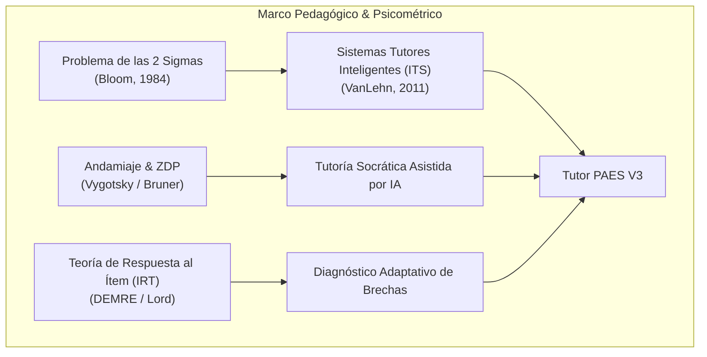
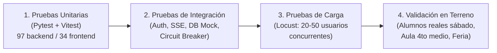
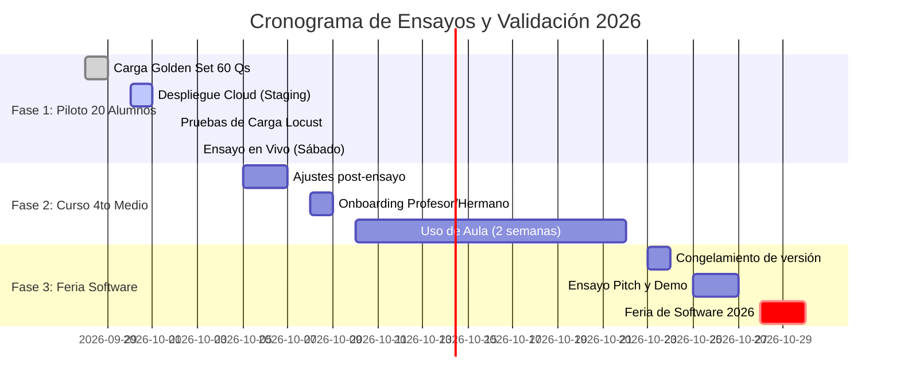

# 05 — Contexto Académico, Metodología de Validación y Pruebas

**Proyecto:** Tutor PAES V3  
**Fecha:** 28 de Septiembre de 2026  
**Audiencia:** Agentes de desarrollo (`agy`, `agy2 / gemini2`, `claude`, `opencode`), docentes supervisores y evaluadores de la Feria de Software.

---

## 1. Fundamentación Teórica y Pedagógica

El diseño e implementación de Tutor PAES no se reduce a una interfaz conversacional estándar conectada a un LLM; está fundamentado en cuatro pilares de las ciencias del aprendizaje y la psicometría educativa:

### 1.1. El Problema de las 2 Sigmas de Benjamin Bloom (1984)
* **Principio:** La investigación seminal de Bloom demostró que un estudiante promedio tutorado 1-a-1 con técnicas de *Mastery Learning* alcanza un desempeño superior en **dos desviaciones estándar (2 sigmas)** respecto al promedio de una clase tradicional (es decir, el percentil 50 asciende al percentil 98).
* **Aplicación en Tutor PAES:** Hasta la llegada de los LLMs de baja latencia, proporcionar un tutor 1-a-1 a cada estudiante de educación pública era inviable económica y logísticamente. Tutor PAES aprovecha la inferencia ultra-rápida (Groq / Cerebras) y prompts estructurados para democratizar este acompañamiento individualizado a costo marginal cero.

### 1.2. Andamiaje Cognitivo (*Scaffolding*) y Zona de Desarrollo Próximo (ZDP)
* **Principio (Vygotsky / Bruner):** El aprendizaje ocurre en la ZDP: el espacio entre lo que el alumno puede resolver de forma autónoma y lo que puede lograr con la guía de un tutor capacitado.
* **Aplicación en Tutor PAES:** El sistema **nunca debe dar la respuesta correcta directamente** (anti-spoonfeeding). Aplica una progresión de pistas en 3 niveles:
  1. **Nivel 1 (Pista Conceptual):** Identifica el eje o concepto clave necesario (ej. *"Recuerda la propiedad de productos de potencias de igual base"*).
  2. **Nivel 2 (Pista Procedural):** Sugiere el primer paso de cálculo o análisis sin completar la operación (ej. *"¿Qué ocurre si factorizas el numerador por el término común?"*).
  3. **Nivel 3 (Explicación Paso a Paso):** Solo accesible cuando el intento finalizó o el alumno falló reiteradamente, desglosando la justificación de la alternativa correcta y la razón de descarte de cada distractor oficial.

### 1.3. Teoría de Respuesta al Ítem (TRI / IRT) y Escala DEMRE
* **Principio:** A diferencia del puntaje bruto simple (preguntas correctas / total), la PAES chilena evalúa a los postulantes mediante un modelo psicométrico TRI de 3 parámetros (dificultad $b$, discriminación $a$ y pseudo-adivinación $c$).
* **Escala Oficial:** 100 a 1000 puntos.
* **Aplicación en Tutor PAES:** Los algoritmos de diagnóstico no ponderan todas las preguntas por igual: identifican debilidades temáticas según la complejidad del ítem y el eje del temario oficial DEMRE (ej. Álgebra y Funciones, Geometría, Números, Probabilidad y Estadística, Comprensión Lectora).

---

## 2. Metodología de Validación Multidimensional

Para evaluar rigurosamente el rendimiento técnico, la fidelidad pedagógica y el impacto en los estudiantes, se define una matriz de métricas objetivas:

### 2.1. Métricas de Rendimiento Técnico y Concurrencia (SLA)

| Métrica | Definición / Fórmula | Objetivo (Target) | Herramienta de Medición |
| :--- | :--- | :--- | :--- |
| **TTFT (Time to First Token)** | Tiempo transcurrido entre la petición del usuario y el primer token recibido vía SSE | **< 500 ms** (P95) | Métricas internas / Prometheus |
| **TRT (Total Response Time)** | Duración total de la generación de una pista o explicación completa | **< 3.500 ms** (P95) | FastAPI Middleware / OpenTelemetry |
| **Tasa de Errores HTTP** | Ratio de peticiones `status_code >= 500` sobre el total | **< 0.1%** | Logs de producción y Prometheus |
| **Concurrencia Estable** | Usuarios rindiendo ensayo o chateando simultáneamente sin degradación | **>= 20 usuarios** (Hito 1) **>= 50 usuarios** (Hito 2) | Locust / k6 load tests |
| **Trip Rate Circuit Breaker** | Frecuencia de caídas de proveedores LLM que activan el fallback secundario | **< 1%** de requests | Redis Circuit Breaker status |

### 2.2. Métricas de Calidad de Respuesta Pedagógica (Rúbrica de IA)

| Criterio | Descripción | Umbral de Aceptación | Método de Validación |
| :--- | :--- | :--- | :--- |
| **Fidelidad Socrática** (*Anti-Spoonfeeding*) | Porcentaje de pistas donde el tutor guía sin entregar la letra de la opción ni el resultado numérico directo | **> 98%** | Auditoría con LLM evaluador (Judge) y muestreo ciego docente |
| **Corrección Matemática KaTeX** | Porcentaje de fórmulas y expresiones LaTeX que renderizan sin syntax error ni caracteres corruptos | **100%** | Test sintáctico regex + render headless KaTeX |
| **Tasa de Alucinación Curricular** | Afirmaciones que contradigan el temario oficial DEMRE o las propiedades formales de la disciplina | **< 1.5%** | Muestreo manual docente (30 prompts tipo) |
| **Adecuación de Tono y Registro** | Lenguaje empático, pedagógico, motivador, en español chileno educacional neutro | **> 4.5 / 5.0** | Encuesta Likert a estudiantes del piloto |

### 2.3. Métricas de Impacto en el Aprendizaje

1. **Delta de Puntaje Estimado ($\Delta S$):** Comparación entre el Ensayo Diagnóstico Inicial ($S_{pre}$) y el Ensayo Final ($S_{post}$):
   $$\Delta S = S_{post} - S_{pre}$$
2. **Eficiencia en Resolución de Errores (*Time-to-Correction*):** Número de intentos y pistas requeridas antes de que el estudiante resuelva un problema similar de la misma habilidad cognitiva.
3. **Engagement y Adherencia:** 
   - Tasa de finalización de ensayos iniciados (> 85%).
   - Sesiones recurrentes de estudio (> 3 sesiones/semana por alumno).

---

## 3. Batería de Pruebas de Software y Entornos

El pipeline de calidad opera bajo un esquema continuo de cuatro niveles de verificación:

### 3.1. Estado Actual de la Suite Automatizada
* **Backend (`pytest`):**
  * `97 tests` operativos con 100% de aprobación.
  * Cobertura de autenticación JWT, hashing argon2, rutas de ensayos, generación de reportes y fallback resiliente de LLMs.
* **Frontend (`vitest`):**
  * `34 tests` unitarios operativos con 100% de aprobación.
  * Cobertura de stores Zustand (`useQuizStore`), hooks React Query, componentes UI base y renderizado de alternativas.
* **Compilación Next.js (`npm run build`):**
  * Compilación limpia en 5.8 segundos con Turbopack, cero errores de tipado TypeScript y cero advertencias de bundle crítico.

### 3.2. Protocolo de Pruebas de Carga (Locust)
Previo al ensayo del sábado 3 de Octubre, se ejecutará el siguiente script de carga en el entorno de pre-producción:
* **Escenario:** 20 usuarios virtuales (`UserBehavior`) ejecutando concurrentemente:
  1. Login con credenciales pre-sembradas (`alumnoXX@tutorpaes.cl`).
  2. Obtención de preguntas del ensayo diagnóstico oficial (30 preguntas M1).
  3. Envío escalonado de respuestas cada 45 a 90 segundos.
  4. Solicitud de 2 pistas socráticas (`/hint`) y 1 chat conversacional por cada 5 preguntas.
* **Criterio de Aprobación:** Cero timeouts (HTTP 504), P99 de latencia backend < 1200ms, consumo de conexiones PostgreSQL $\le 25$ conexiones.

---

## 4. Cronograma de Validación en Terreno (Las 3 Fases)

### 4.1. Fase 1: Prueba de Fuego del Sábado (3 de Octubre)
* **Población:** 20 alumnos de educación media rindiendo simultáneamente.
* **Instrumento:** Ensayo Diagnóstico 1 (30 preguntas M1 y 30 preguntas Comprensión Lectora curadas).
* **Objetivo de Investigación:** Medir la estabilidad de los SSE, la satisfacción de los alumnos con el tutor socrático y detectar posibles cuellos de botella en la base de datos bajo concurrencia real.

### 4.2. Fase 2: Piloto de Aula en 4to Medio (Profesor Colaborador)
* **Población:** Curso completo de 4to Medio dirigido por el profesor colaborador (hermano de Gabriel).
* **Instrumento:** Uso diario de micro-quizzes de ejercitación y acceso del docente a `TeacherDashboardView`.
* **Objetivo de Investigación:** Validar la utilidad de la telemetría docente para la toma de decisiones pedagógicas en el aula (ej. detectar que el 70% del curso falló en *"Geometría Analítica"* antes de la clase semanal).

### 4.3. Fase 3: Demostración en Vivo en Feria de Software 2026
* **Audiencia:** Evaluadores académicos, comités de innovación universitaria y público general.
* **Instrumento:** Demostración interactiva en stand con código QR para pruebas instantáneas desde smartphones de visitantes.
* **Objetivo de Difusión:** Demostrar la viabilidad técnica y pedagógica de la tutoría socrática con IA en el ecosistema educacional chileno.

---

## 5. Referencias Académicas y Documentación Base

1. **Bloom, B. S. (1984).** *The 2 Sigma Problem: The Search for Methods of Group Instruction as Effective as One-on-One Tutoring*. Educational Researcher, 13(6), 4–16.
2. **VanLehn, K. (2011).** *The Relative Effectiveness of Human Tutoring, Intelligent Tutoring Systems, and Other Tutoring Systems*. Educational Psychologist, 46(4), 197–221.
3. **DEMRE — Universidad de Chile (2023–2026).** *Compendio de Criterios de Evaluación y Temarios Oficiales PAES: Competencia Matemática 1 (M1) y Competencia Lectora*. Santiago de Chile: Vicerrectoría de Asuntos Académicos.
4. **Lord, F. M. (1980).** *Applications of Item Response Theory to Practical Testing Problems*. Lawrence Erlbaum Associates.
5. **Macina, J., et al. (2023).** *Opportunities and Challenges in Socratic Conversational AI for Education*. Proceedings of the 2023 Conference on Empirical Methods in Natural Language Processing (EMNLP).
6. **Khan, S. (2024).** *Brave New Words: How AI Will Revolutionize Education (and Why That's a Good Thing)*. Viking Press.
7. **Sweller, J. (1988).** *Cognitive Load During Problem Solving: Effects on Learning*. Cognitive Science, 12(2), 257–285.
