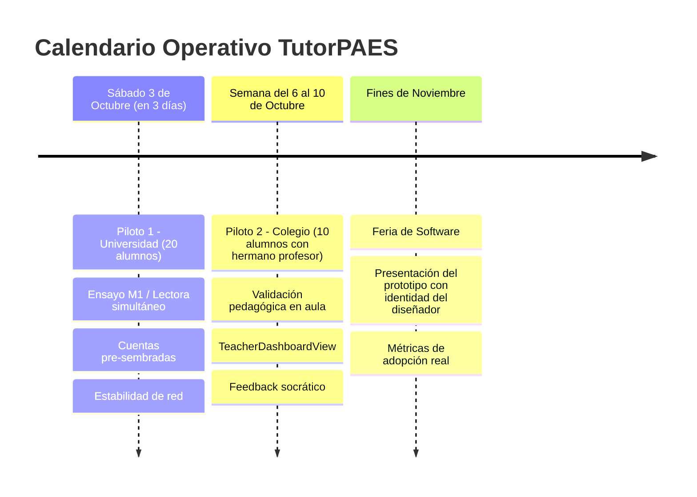

# 08 — Plan Operativo de Pruebas Piloto (Octubre 2026) y Hoja de Ruta

**Proyecto:** Tutor PAES V3  
**Fecha:** 30 de Septiembre de 2026  
**Objetivo Estratégico:** Validar el sistema en condiciones de uso real antes de la Feria de Software de Noviembre.

---

## 1. Los Tres Hitos Temporales

### A. Hito 1: Sábado (Universidad, 20 alumnos)
* **Público:** 20 estudiantes universitarios / postulantes.
* **Foco:** Rendimiento de concurrencia, fluidez de streaming de la Tuto, cero fricción de registro y precisión de puntaje estimado.
* **Solución de Onboarding:** 20 cuentas pre-sembradas en la base de datos (`alumno01@tutorpaes.cl` a `alumno20@tutorpaes.cl` con contraseña `paes2026`). Cero dependencia de correos de activación SMTP.
* **Conectividad:** Túnel Cloudflare en Santiago (`scripts/start-local-tunnel.sh`) o despliegue en la nube (Vercel + Railway).

### B. Hito 2: Próxima Semana (Colegio, 10 alumnos con hermano profesor)
* **Público:** 10 alumnos de 4to medio en sala de clases guiados por el hermano de Gabriel.
* **Foco:** Validación pedagógica del Tutor Socrático. ¿Las pistas ayudan a destrabar el ejercicio? ¿El profesor puede ver el avance de sus alumnos?
* **Módulo Docente:** Cuenta `profesor.hermano@tutorpaes.cl` vinculada a un curso con los 10 alumnos inscritos, habilitando la vista `TeacherDashboardView` para ver estadísticas de error en tiempo real.

### C. Hito 3: Noviembre (Feria de Software 2026)
* **Público:** Jurado evaluador, preuniversitarios y público general.
* **Identidad Visual:** Integración de la identidad de marca diseñada por el diseñador gráfico contratado (logotipo, paleta de colores, tipografía y estilo de componentes).
* **Posicionamiento:** Plataforma SaaS validada empíricamente en 2 pruebas de campo reales con datos de satisfacción y mejora de puntaje.

---

## 2. Matriz de Tareas por Agente y Rol

| Área / Agente | Tarea Específica | Prioridad | Detalle Técnico |
| :--- | :--- | :---: | :--- |
| **Backend (`agy2`)** | **1. Seeding Dataset DEMRE 2026** | **P0 (Inmediata)** | Actualizar `scripts/seed_paes_data.py` para cargar las 329 preguntas de `preguntas_demre_2026_auditadas_final.jsonl` en PostgreSQL. |
| **Backend (`agy2`)** | **2. Pre-sembrado de Usuarios Piloto** | **P0 (Inmediata)** | Crear script `scripts/seed_pilot_users.py` con 20 alumnos universitarios (`alumno01-20`), 10 alumnos escolares (`escolar01-10`) y 1 profesor (`profesor.hermano@tutorpaes.cl`). |
| **Frontend (`claude`)** | **3. Puente Explicación $\rightarrow$ Tutor IA** | **P1 (Urgente)** | Botón *"Preguntar a la Tuto"* en cada pregunta fallada. Abre el drawer/modal de chat inyectando el contexto de la pregunta y la alternativa marcada por el alumno. |
| **Frontend (`claude`)** | **4. Pantalla de Debrief + Score PAES** | **P1 (Urgente)** | Vista final post-quiz que reemplaza el "8/10" por una tarjeta oficial: **"Puntaje Estimado: 685 pts"** (escala 100-1000) con análisis de fortalezas y debilidades. |
| **Frontend (`claude`)** | **5. Generative UI: Widget de Parábola** | **P2 (Diferenciador)** | Implementar el parser en `use-ai-tutor.ts` que intercepta `[WIDGET:PARABOLA\|...]` y monta `<ParabolaWidget />` interactivo estilizado con Tailwind CSS. |
| **Orquestador** | **6. Salida Pública / Túnel de Red** | **P1 (Urgente)** | Probar y documentar `./scripts/start-local-tunnel.sh` o el push de frontend a Vercel con backend en Railway. |

---

## 3. Especificación Rápida de las Features Frontend para Claude

### Feature 1: Puente Explicación $\rightarrow$ Tutor Socrático
* **Ubicación:** Componente de revisión de preguntas post-respuesta (`QuestionExplanation` / `QuizReview`).
* **Comportamiento:**
  * Si el alumno falló la pregunta o desea profundizar, hace clic en el botón con icono de bombilla/robot: **"Preguntar a la Tuto"**.
  * Abre la interfaz de chat socrático y envía automáticamente un mensaje de contexto oculto:  
    > *"El alumno contestó la alternativa [X] para la pregunta: [Prompt]. La respuesta correcta es [Y]. Inicia una guía socrática preguntando al alumno qué razonamiento siguió para elegir [X]."*

### Feature 2: Pantalla de Debrief Post-Ensayo
* **Ubicación:** Ruta `/protected/quiz/results/[id]` o modal de finalización.
* **Componentes:**
  1. **Tarjeta de Puntaje PAES:** Cálculo lineal DEMRE sobre escala 100–1000 según porcentaje de acierto.
  2. **Medidor de Tiempo:** Tiempo promedio por pregunta (meta: <2.5 minutos).
  3. **Desglose por Habilidad/Eje:** Correctas/Incorrectas en Álgebra, Geometría, Números y Probabilidad.
  4. **Recomendación Socrática:** Tarjeta con 2 tópicos clave recomendados por la IA para repasar hoy.
