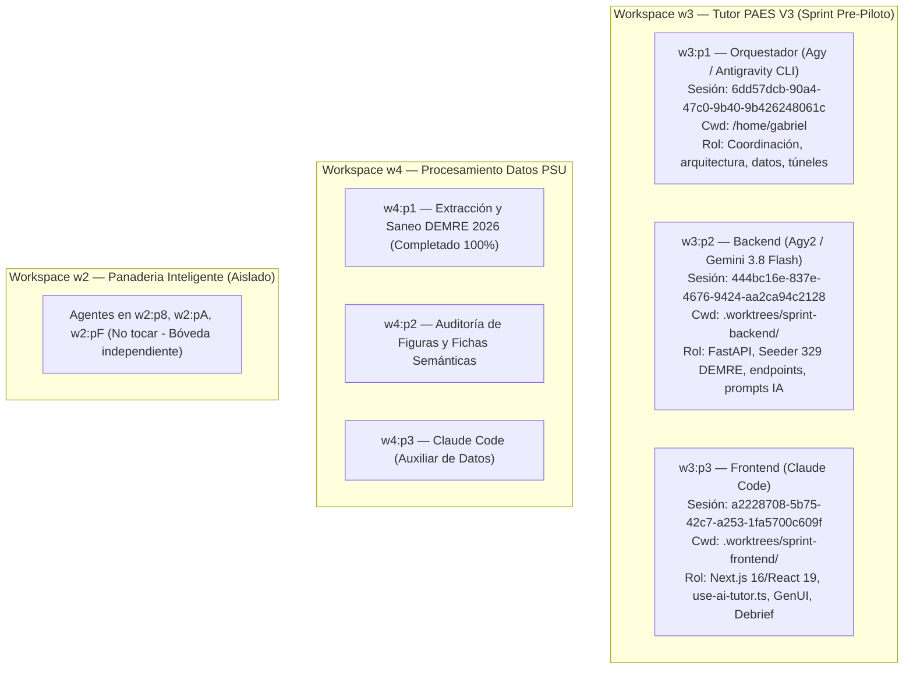

# 09 — Mapeo del Entorno Herdr, Paneles y Estado de los Agentes

**Proyecto:** Tutor PAES V3  
**Fecha:** 30 de Septiembre de 2026  
**Entorno de Orquestación:** Herdr (Multi-Workspace / Paneles Multiplexados)  
**Bóveda Canónica:** `/home/gabriel/Memoria semantica/TutorPAES/`  
**Repositorio Principal:** `/home/gabriel/Escritorio/Proyectos2026/Tutor-PaesV3/`

---

## 1. Mapeo de Workspaces y Paneles en Herdr

El entorno local de Herdr organiza los proyectos en tres workspaces concurrentes:



---

## 2. Estado de Cada Agente en Tutor PAES (`w3`)

### 🟢 Agente 1: Orquestador (`w3:p1` — Agy)
* **Estado:** Activo (Generando documentación canónica y gobernanza).
* **Entregable completado:** Saneó y auditó el banco de preguntas oficial (329 preguntas DEMRE 2026 aprobadas en JSONL, 97 figuras recortadas a 300 DPI y fichas semánticas generadas).
* **Siguiente paso:** Supervisar el seed en PostgreSQL y probar `./scripts/start-local-tunnel.sh` para el acceso de los 20 alumnos de la universidad este sábado.

### 🟡 Agente 2: Backend (`w3:p2` — Agy2 / Gemini 3.8 Flash)
* **Estado:** Standby (Esperando orden de ejecución).
* **Directorio de trabajo:** `.worktrees/sprint-backend/` (FastAPI).
* **Último commit:** `cece03c` (*feat: soporte oficial OpenRouter con circuit breaker y streaming*).
* **Tareas asignadas confirmadas por Agy2:**
  1. **Tarea 2.1:** Actualizar `tutorpaes/backend/scripts/seed_paes_data.py` para ingerir las **329 preguntas oficiales DEMRE 2026** desde `salida_lista_hoy/preguntas_demre_2026_auditadas_final.jsonl` a PostgreSQL.
  2. **Tarea 2.2:** Crear script `scripts/seed_pilot_users.py` para generar las 20 cuentas universitarias (`alumno01@tutorpaes.cl` a `alumno20@tutorpaes.cl` con clave `paes2026`), 10 cuentas de colegio y 1 cuenta docente (`profesor.hermano@tutorpaes.cl`).
  3. **Tarea 2.3:** Adaptar el System Prompt del Tutor Socrático para emitir marcadores de Generative UI (`[WIDGET:PARABOLA|a=...,b=...,c=...]`) y asegurar que el endpoint de resumen entregue el puntaje PAES estimado (100–1000 pts).

### 🟡 Agente 3: Frontend (`w3:p3` — Claude Code)
* **Estado:** Standby (Esperando orden de ejecución).
* **Directorio de trabajo:** `.worktrees/sprint-frontend/` (Next.js 16 / React 19).
* **Último commit:** `6e56652` (*docs: especificacion de arquitectura para Generative UI en tutor socratico*).
* **Tareas asignadas confirmadas por Claude:**
  1. **Tarea 3.1 (GenUI):** En `use-ai-tutor.ts` y componentes de chat, implementar el parser que intercepta `[WIDGET:PARABOLA|args]` durante el streaming SSE y monta el componente `<ParabolaWidget />` con Tailwind CSS sin romper KaTeX.
  2. **Tarea 3.2 (Puente Explicación $\rightarrow$ Tutor):** Botón *"Preguntar a la Tuto"* en las explicaciones de preguntas falladas, abriendo el drawer con el contexto inyectado.
  3. **Tarea 3.3 (Debrief PAES):** Pantalla final post-ensayo con estimación de puntaje PAES en tarjeta oficial (100 a 1000 puntos), medidor de tiempo y recomendaciones de estudio.

---

## 3. Comandos CLI de Herdr para Comunicar y Controlar Agentes

Desde cualquier terminal o sesión del Orquestador se puede interactuar con los paneles de Herdr mediante:

```bash
# 1. Ver estado de todos los agentes
herdr agent list

# 2. Leer la pantalla / último mensaje de un agente
herdr agent read w3:p2  # Lee a Agy2 (Backend)
herdr agent read w3:p3  # Lee a Claude (Frontend)

# 3. Enviar una instrucción directa al prompt de un agente
herdr agent prompt w3:p2 "Comienza con la Tarea 1: actualizar seed_paes_data.py..."
herdr agent prompt w3:p3 "Comienza con la Tarea 1: implementar widget de parábola en use-ai-tutor.ts..."
```

---

## 4. Instrucción Exacta para Despertar a los Agentes tras el Reinicio

Cuando Gabriel inicie la sesión limpia, estos son los dos comandos exactos para poner a trabajar a Claude y Agy2 en paralelo:

### Para Claude en `w3:p3` (Frontend):
```bash
herdr agent prompt w3:p3 "¡Hola Claude! Arrancamos el sprint frontend. Revisa docs/architecture/GENERATIVE_UI_SPECIFICATION.md e implementa la Tarea 1: intercepción de marcadores [WIDGET:PARABOLA|args] en use-ai-tutor.ts y el componente interactivo ParabolaWidget con Tailwind. Trabaja exclusivamente en .worktrees/sprint-frontend/."
```

### Para Agy2 en `w3:p2` (Backend):
```bash
herdr agent prompt w3:p2 "¡Hola Agy2! Arrancamos el sprint backend. Tarea 1 prioritaria: actualiza tutorpaes/backend/scripts/seed_paes_data.py para que consuma /home/gabriel/Escritorio/Proyectos2026/Procesamiento_Datos_Psu/salida_lista_hoy/preguntas_demre_2026_auditadas_final.jsonl y siembre las 329 preguntas DEMRE 2026 en PostgreSQL. Luego crea scripts/seed_pilot_users.py con los 20 alumnos pre-sembrados."
```
